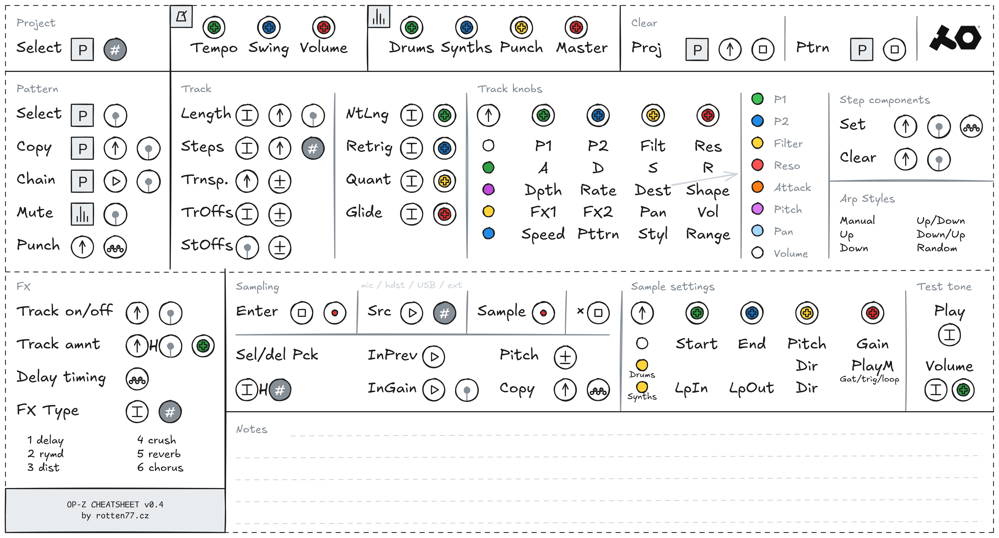

# Teenage Engineering OP-Z Cheatsheet

This repository hosts a personal cheatsheet for the Teenage Engineering OP-Z synthesizer/sequencer, designed for quick reference during creative sessions. While tailored to my own workflow and preferences, it may still offer valuable insights for other OP-Z users!

* **Built with [Excalidraw](https://excalidraw.com/)**: The cheatsheet is drawn using Excalidraw, making it easy to read and modify.
  * **Download the latest version: [opz_cheatsheet_0.4.excalidraw](opz_cheatsheet_0.4.excalidraw)**
* **Icon Library Included**: Contains a library of OP-Z-specific icons and elements. Use these to create your own custom layout or develop personal shortcodes and memory aids!
  * **Download the library: [opz_cheatsheet_library.excalidrawlib](opz_cheatsheet_library.excalidrawlib)**

## Version 0.4

* The Sampling section was added
* *Download: [opz_cheatsheet_0.4.excalidraw](opz_cheatsheet_0.4.excalidraw)*

